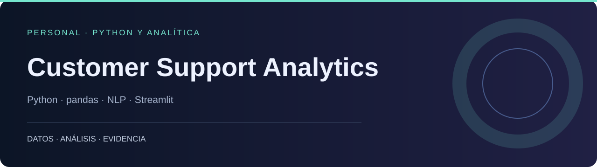

# Customer Support Analytics

**Exploración de conversaciones de soporte con métricas, calidad de datos y análisis de texto.**

PERSONAL · PYTHON Y ANALÍTICA · Python · pandas · NLP · Streamlit

[Portafolio](https://dodysalim.github.io/) · [Caso y alcance](docs/PORTFOLIO_CASE.md) · [Verificación](docs/VALIDATION.md)

## La pregunta

¿Qué patrones de canal, sentimiento y resultado aparecen en las conversaciones de soporte?

## Qué puedes revisar

- Siete vistas: resumen, distribución, sentimientos, urgencia, NLP, A/B y calidad.
- Módulos reutilizables de limpieza, estadísticas, características y evaluación.
- Análisis SQL, notebooks y Power BI de siete páginas.

## Inicio local

Usa Python 3.11 o 3.12 en un entorno independiente. Desde la raíz:

```bash
python -m venv .venv
# Windows: .venv\Scripts\activate
# macOS/Linux: source .venv/bin/activate
python -m pip install -r requirements.txt
# Dataset versionado con Git LFS:
git lfs pull
```

Después de configurar los datos:

```bash
python -m streamlit run src/app/dashboard.py
```

## Datos y configuración

El CSV grande requiere Git LFS. También puedes definir CUSTOMER_SUPPORT_DATA con la ruta de un CSV disponible. El dashboard carga primeras filas, no una muestra aleatoria.

## Power BI · PC y móvil

[Archivos e instrucciones](powerbi/README.md). Descarga el repositorio completo y abre `powerbi/Abrir-PowerBI.bat` en Windows; después pulsa **Actualizar**. Incluye A4 horizontal a tamaño real (100 %) y diseño móvil vertical. El archivo `.pbip` necesita sus carpetas Report, SemanticModel y data.

## Recorrido por el código

| Ruta | Qué contiene |
| --- | --- |
| [src/app/](src/app/) | Dashboard y vistas |
| [src/modules/](src/modules/) | Motores reutilizables |
| [notebooks/](notebooks/) | EDA, SQL y soporte |
| [data/](data/) | Dataset versionado mediante LFS |

## Comprobación y alcance

Siete vistas probadas sin excepciones con una muestra de 50.000 filas originales. No existe cobertura global de pruebas para todos los módulos.

Las conversaciones se deduplican por conv_id para los KPIs. La comparación A/B es observacional y no demuestra causalidad. El NLP usa un subconjunto; las tablas precalculadas de Power BI conservan ese alcance.

## Autoría

Proyecto personal. Dody Salim Dueñas Remache.

[Documentación anterior](docs/ORIGINAL_README.md), conservada como referencia histórica.
